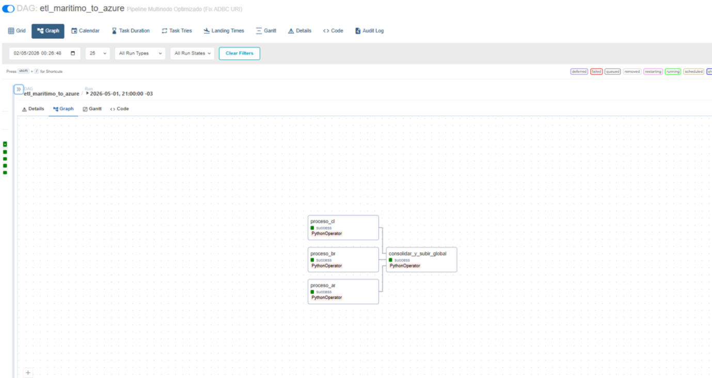

# 🚢 Airflow ETL Multinodo – PostgreSQL → Azure Data Lake

## 📌 Descripción

Este proyecto implementa un pipeline ETL para la consolidación de operaciones marítimas provenientes de múltiples nodos regionales (Argentina, Brasil y Chile).

El sistema procesa grandes volúmenes de datos (≈1.5M registros diarios), realizando:

* Extracción paralela desde múltiples bases PostgreSQL
* Transformación a formato columnar (Parquet)
* Carga en Azure Data Lake

---

## 📊 Ejecución del DAG

A continuación se muestra la ejecución del pipeline en Apache Airflow, evidenciando la extracción paralela por país y la consolidación final:



---

## 🏗️ Arquitectura del Sistema

* **Fuentes**: 3 bases PostgreSQL independientes (AR, BR, CL)
* **Orquestación**: Apache Airflow
* **Procesamiento**: Python (pandas / polars)
* **Storage**: Azure Blob Storage (raw zone)
* **Infraestructura**: Docker Compose

---

## ⚙️ Infraestructura

### 🐳 Contenerización

* Airflow + PostgreSQL desplegados con Docker Compose
* Aislamiento completo de servicios

### 💾 Persistencia

* Volúmenes locales:

  ```
  ./data/{pais}
  ```
* Evita pérdida de datos ante reinicios

### 🔐 Gestión de Credenciales

* Variables de entorno
* Airflow Connections:

  * `conn_node_ar`
  * `conn_node_br`
  * `conn_node_cl`
  * `azure_blob_connection`

---

## 🔄 Lógica ETL

### 1. Extracción

* Uso de `PostgresHook`
* Queries concurrentes por país
* Optimización de tiempo total

### 2. Transformación

* Migración de **pandas → polars**
* Conversión a Parquet con `pyarrow`

**Ventajas:**

* menor tamaño en Azure
* mayor velocidad en Power BI

---

### 3. Carga

* Uso de `WasbHook`
* Destino:

  ```
  Azure Blob → datos-maritimos/raw/
  ```

---

## 🚀 Ejecución

### Build

```bash
docker-compose build --no-cache
```

### Levantar servicios

```bash
docker-compose up -d
```

### Airflow UI

```
http://localhost:8080
```

---

## 🧪 Problemas

### ❌ Error: UndefinedTable

**Causa:**

* pérdida de esquemas en contenedores

**Solución:**

* volúmenes persistentes
* script `init_operaciones.sql`

---

### ❌ Error: Docker host no resuelve nombres

**Causa:**

* networking entre contenedores

**Solución:**

* uso correcto de nombres de servicio (docker-compose)

---

### ❌ Error: AirflowException (start_date)

**Solución:**

* definir `default_args`
* evitar catchup no deseado

---

### ❌ Error: Azure auth

`Unable to determine account name`

**Solución:**

* usar:

  * Login → Account Name
  * Password → Access Key

---

### ❌ Error: SQLAlchemy / engine (Polars)

**Solución:**

* eliminar argumento `engine`
* adaptar conexión a nueva API

---

## ⚡ Optimizaciones Implementadas

* Paralelismo en extracción
* Migración a Polars (multithreading)
* Uso de Parquet (compresión + performance)
* Eliminación de overhead de serialización (ADBC driver)

---

## 📊 Volumen de Datos

* ~500.000 registros por nodo
* ~1.5M registros totales por ejecución
* Procesamiento optimizado en segundos

---

## 🧠 Decisiones Técnicas

* **Docker** → reproducibilidad
* **Airflow** → orquestación y control
* **Parquet** → formato analítico eficiente
* **Polars** → performance superior a pandas

---

## 📂 Estructura del Proyecto

```
.
├── dags/
├── data/
│   ├── ar/
│   ├── br/
│   └── cl/
├── scripts/
│   └── init_operaciones.sql
├── docker-compose.yml
└── README.md
```

---

## 👨‍💻 Autor

Lucas Luiselli
Business Intelligence Analyst

---

## 🧭 Próximos pasos

* Particionado por fecha/país
* Integración con Synapse / Data Factory
* Validaciones de calidad (Great Expectations)
* CI/CD para DAGs

---
